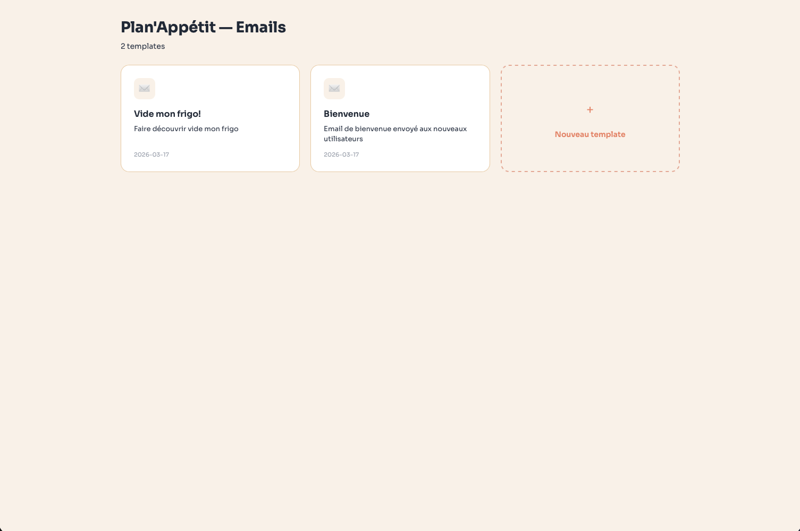
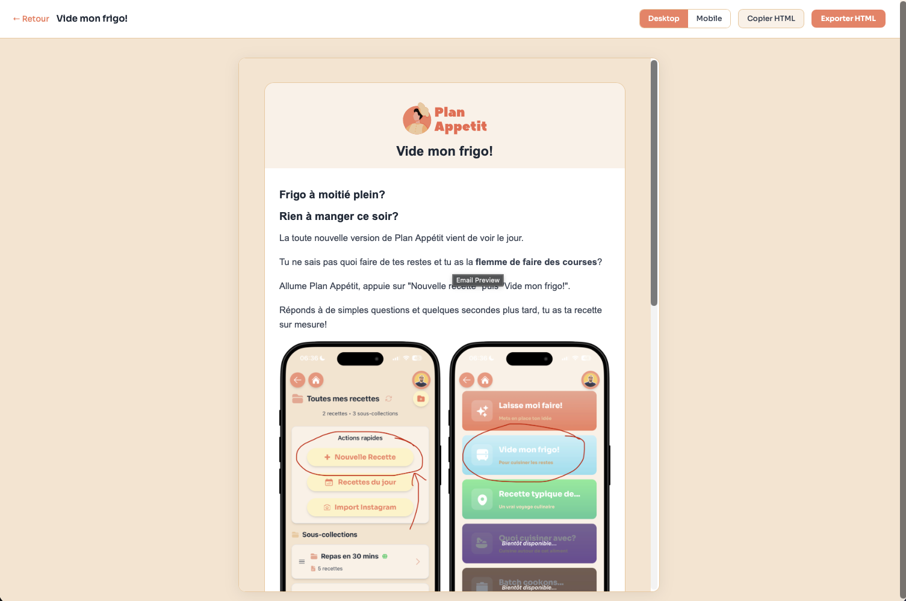

# Plan'Appetit — Email Templating

App locale pour construire, previewer et exporter les templates email de Plan'Appetit.





## Stack

- **React + TypeScript + Vite** pour l'app
- **react-email** pour des composants email compatibles tous clients (Gmail, Outlook, Apple Mail...)
- **Tailwind** pour l'UI de l'app (pas pour les emails)

## Utilisation

```bash
npm install
npm run dev
```

- **Galerie** — Vue d'ensemble de tous les templates avec creation via formulaire
- **Preview** — Rendu live avec toggle desktop/mobile
- **Exporter HTML** — Genere un fichier dans `output/` pret a uploader sur Resend (images inlinees en base64)
- **Copier HTML** — Copie le HTML dans le presse-papier

## Creer un template

Cliquer sur "Nouveau template" dans la galerie, ou copier un dossier existant dans `src/templates/`.

Chaque template est un dossier avec :
- `index.tsx` — le composant React (react-email)
- `meta.json` — nom, description, date

## Composants reutilisables

| Composant | Role |
|-----------|------|
| `EmailLayout` | Wrapper HTML, fonts, container 600px |
| `EmailHeader` | Logo cliquable + titre |
| `EmailFooter` | Lien Plan'Appetit + desinscription Resend |
| `EmailButton` | CTA primary/secondary |
| `EmailBody` | Corps + `EmailText` + `EmailHeading` |
| `EmailScreenGrid` | Grille 2x2 de screenshots |

Tous les liens incluent automatiquement les parametres UTM (`utm_source`, `utm_medium`, `utm_campaign`, `utm_content`).
